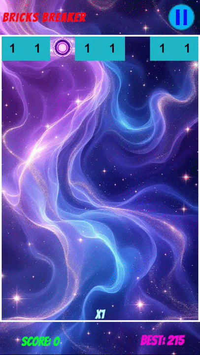
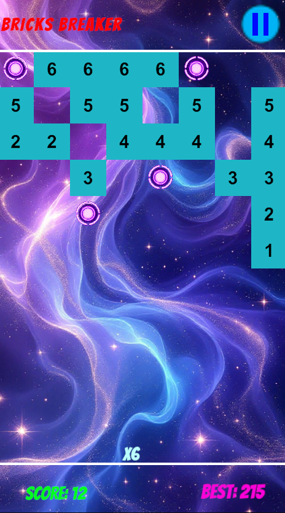
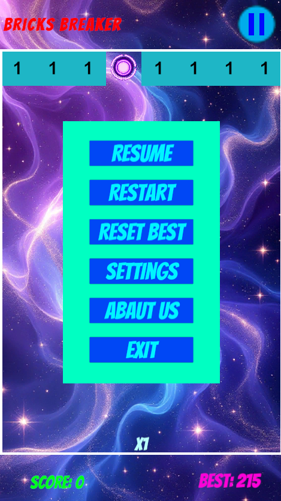
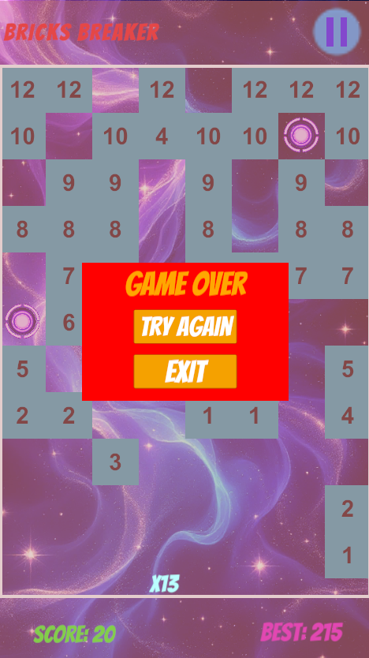
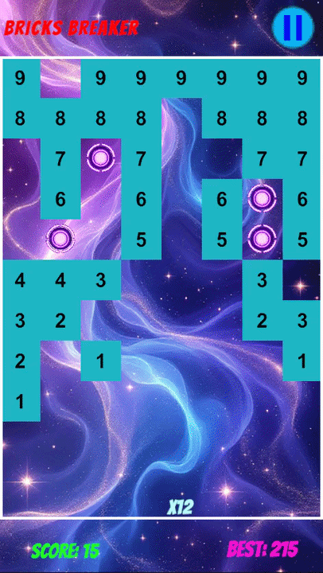

# 🧱 Bricks Breaker Quest

<p align="center">
  
</p>

<h1 align="center">🧱 Bricks Breaker Quest</h1>

<p align="center">
  A fast-paced 2D brick breaking game made with Unity.
</p>

<p align="center">
  
</p>

<p align="center">
  
  
  
  
</p>

---

## 🎮 About the Game

**Bricks Breaker Quest** is a 2D brick breaking game developed with **Unity and C#**.

Launch balls toward the bricks, break as many bricks as possible, and progress through increasingly challenging rounds.

The game is designed around simple touch controls, multiple balls, brick destruction, round progression, and satisfying destruction effects.

---

## ✨ Features

* 🧱 Brick breaking gameplay
* ⚽ Multiple ball system
* 🎯 Touch-based aiming and shooting
* 🔢 Increasing ball count
* 🔄 Round-based progression
* 💥 Brick destruction effects
* 🧩 Brick fragments
* ⚡ Ball increase system
* 🎮 Mobile-friendly controls
* 📱 Unity Input System
* 🔊 Gameplay sound effects
* ♻️ Object pooling for optimized object management
* 🏆 Progressive gameplay difficulty

---

## 📸 Screenshots

<p align="center">
  
  
  
</p>

---

## 🎬 Gameplay Preview

<p align="center">
  
</p>

The gameplay preview demonstrates the core shooting, ball bouncing, brick breaking, and round progression mechanics.

---

## 🎯 How to Play

1. 👆 Touch and drag to aim the balls.
2. 🎯 Choose the direction of your shot.
3. 🚀 Release to launch the balls.
4. 🧱 Hit the bricks to reduce their durability.
5. 💥 Break bricks and clear the play area.
6. ⚽ Collect additional balls when available.
7. 🔄 Complete the round and continue to the next challenge.
8. 🏆 Try to progress through as many rounds as possible.

---

## 🎮 Controls

### 📱 Mobile

Use touch input to aim and launch the balls.

### 🖥️ PC / Unity Editor

Use the mouse to simulate touch input while testing the game in the Unity Editor.

---

## 🛠️ Built With

* **Unity 6.5**
* **C#**
* **Unity 2D**
* **Unity Input System**
* **Enhanced Touch**
* **Unity Object Pooling**

---

## 📱 Platform

The game is designed primarily for mobile devices.

**Supported / Tested Platforms:**

* 📱 Android
* 🖥️ Windows / Unity Editor

---

## 🚀 How to Run

### 1. Clone the Repository

```bash
git clone YOUR_REPOSITORY_URL
```

### 2. Open the Project

Open the downloaded project using **Unity Hub**.

### 3. Open the Main Scene

Open the game's main menu scene.

```text
Assets/Scenes/MainMenu
```

### 4. Run the Game

Press the **Play** button in Unity.

---

---

## 🧱 Brick System

Each round introduces a set of bricks that the player must destroy using the available balls.

As the game progresses, the number and arrangement of bricks can increase, creating new challenges for the player.

---

## ⚽ Ball System

The game uses a multiple-ball system.

Additional balls can be gained during gameplay, allowing the player to hit more bricks during each launch.

The ball management system also handles the launch sequence and waits for the active balls to finish before continuing the gameplay cycle.

---

## 🔄 Round System

Bricks Breaker Quest uses a round-based progression system.

Each completed round advances the game and introduces new brick configurations.

The number of bricks increases as the player progresses through the rounds.

---

## 💥 Effects

The game includes visual destruction effects for breaking bricks.

Brick fragments are generated when bricks are destroyed to make the gameplay feel more dynamic and satisfying.

---

## ⚡ Performance

The project uses Unity's object pooling system to efficiently manage frequently created and destroyed gameplay objects such as:

* ⚽ Balls
* 🧱 Bricks
* 💥 Brick Fragments
* ⚡ Ball Increase Objects

This helps reduce unnecessary runtime allocations and object creation.

---

## 🔮 Future Improvements

Possible future improvements include:

* 🏆 High score system
* 🎨 More brick types
* ⚡ Additional power-ups
* 💥 More destruction effects
* 🎵 Additional sound effects
* 🌟 Special gameplay modes
* 📱 Further mobile optimization

---

## 👨‍💻 Developer

### **Mahdi Hosseinabadi**

Computer Engineering Student at 
**Web Designer · UI/UX Designer · Unity Game Developer**

### 🌐 GitHub

<p align="center">
  <a href="https://github.com/MahdiHosseinabadi">
    
  </a>
</p>

<p align="center">
  <a href="https://github.com/MahdiHosseinabadi">
    <strong>View my GitHub profile →</strong>
  </a>
</p>

---

## ⭐ Support

If you like this project, consider giving the repository a ⭐ **Star** on GitHub.

---

<p align="center">
  Made with ❤️ and Unity
</p>
